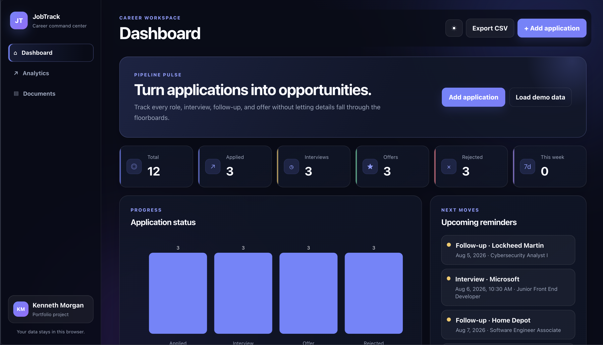
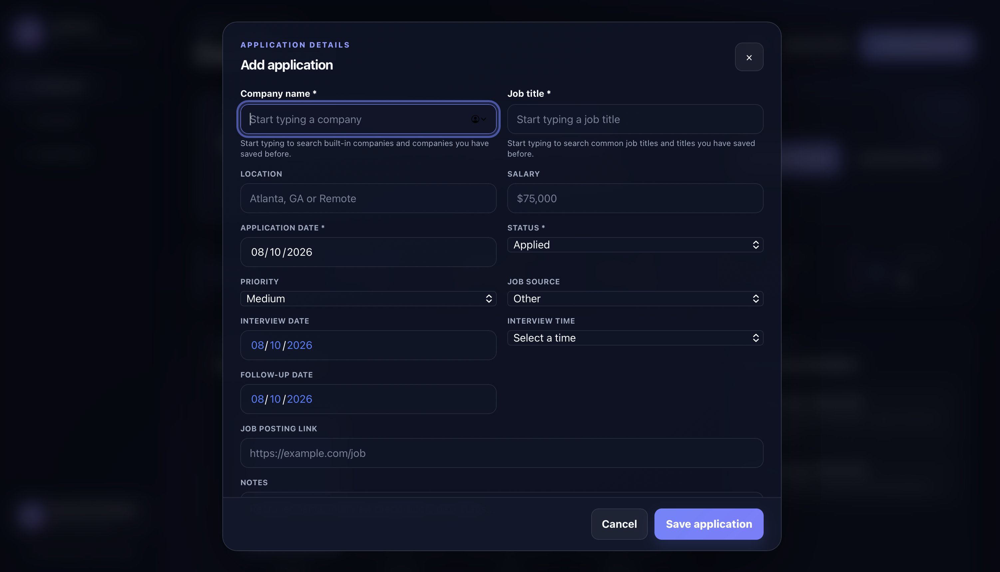
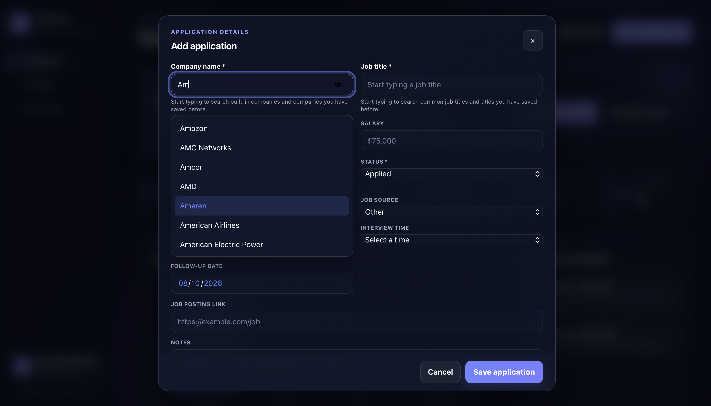
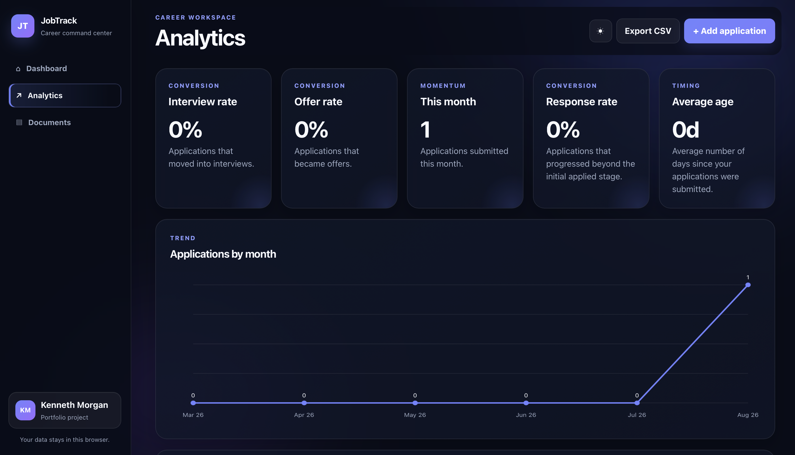
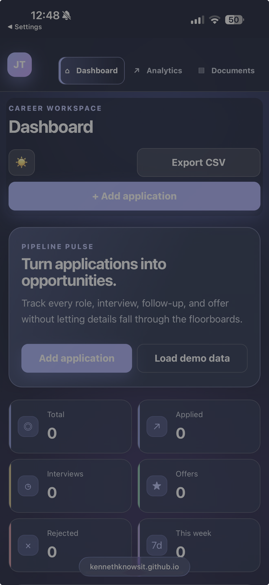

# 💼 JobTrack


A modern SaaS style job application tracker built by **Kenneth Morgan** using **HTML5**, **CSS3**, and **Vanilla JavaScript**.

JobTrack helps job seekers organize applications, track interviews, manage follow ups, analyze their job search progress, and store important information in one place.

---

# 🌐 Live Demo

### https://kennethknowsit.github.io/job-application-tracker/

---

# ✨ Features

## 📋 Application Management

- Add job applications
- Edit existing applications
- Delete applications
- Required field validation
- Responsive application form

---

## 🔍 Smart Autocomplete

- Company name autocomplete
- Job title autocomplete
- Learns companies you previously entered
- Learns job titles you previously entered
- Keyboard navigation
- Mouse selection

---

## 📊 Dashboard

- Total applications
- Applied count
- Interview count
- Offer count
- Rejected count
- Recent activity
- This week's applications
- Response rate
- Average application age

---

## 🔎 Search & Filtering

- Search by company
- Search by position
- Filter by status
- Filter by priority
- Filter by job source

---

## 📅 Interview Tracking

- Interview scheduling
- Interview time tracking
- Follow up reminders
- Upcoming reminders

---

## 📈 Analytics

- Status chart
- Monthly application analytics
- Source analytics
- Response rate
- Dashboard statistics

---

## 📄 Resume Manager

- Upload resume
- Download resume
- Delete resume
- Browser storage using IndexedDB

---

## 📤 Export

- Export applications to CSV

---

## 🎨 Appearance

- Light mode
- Dark mode
- Responsive design
- Desktop
- Tablet
- Mobile

---

# 📸 Screenshots

## Dashboard

The main dashboard provides a complete overview of your job search, including application metrics, analytics, reminders, and recent activity.



---

## Add Application

Create new job applications with company and job title autocomplete, interview scheduling, follow up reminders, and required field validation.



---

## Company & Job Title Autocomplete

Built in autocomplete makes entering applications faster while also learning custom companies and job titles over time.



---

## Analytics Dashboard

Track your progress with visual analytics, response rates, monthly applications, and application statistics.



---

## Mobile Experience

JobTrack is fully responsive and optimized for desktop, tablet, and mobile devices.



---

# 🔒 Privacy

JobTrack is a client side application.

All applications, resumes, and settings remain inside the user's browser using LocalStorage and IndexedDB.

No information is transmitted to external servers.

---

# 🛠 Tech Stack

- HTML5
- CSS3
- JavaScript (ES6+)
- LocalStorage
- IndexedDB
- Git
- GitHub
- GitHub Pages

---

# 📂 Project Structure

```text
job-application-tracker/
│
├── screenshots/
│   ├── dashboard.png
│   ├── add-application.png
│   ├── autocomplete.png
│   ├── analytics.png
│   └── mobile-view.png
│
├── index.html
├── style.css
├── script.js
├── companies.js
├── job_titles.js
└── README.md
```

---

# 🚀 Run Locally

Clone the repository.

```bash
git clone https://github.com/KennethKnowsIT/job-application-tracker.git
```

Open the project folder.

Open **index.html** in your browser.

Or launch the project using the **Live Server** extension in Visual Studio Code for the best development experience.

---

# 💡 What I Learned

Developing JobTrack strengthened my understanding of:

- DOM manipulation
- Event handling
- Form validation
- Responsive web design
- LocalStorage
- IndexedDB
- Search and filtering
- Custom autocomplete systems
- Dashboard analytics
- JavaScript project organization
- Git and GitHub workflows
- Creating user friendly interfaces

Building this project taught me how to organize a larger JavaScript application while focusing on usability, maintainability, and responsive design.

---

# 🔮 Future Roadmap

The next version of JobTrack will transition into a full stack application.

Planned improvements include:

- React frontend
- Node.js backend
- Express REST API
- PostgreSQL database
- User authentication
- Cloud synchronization
- Email reminders
- Kanban board
- Calendar view
- Company logo integration
- AI powered resume suggestions

---

# 📈 Version History

## Version 2.0

- Modern SaaS style interface redesign
- Company autocomplete
- Job title autocomplete
- Required field validation
- Dashboard improvements
- Analytics enhancements
- Responsive UI improvements
- Cleaner project organization

---

## Version 1.0

- CRUD application management
- Dashboard
- Analytics
- Resume manager
- CSV export
- Theme switching
- LocalStorage persistence

---

# 👨‍💻 Author

**Kenneth Morgan**

### GitHub

https://github.com/KennethKnowsIT

### LinkedIn

https://www.linkedin.com/in/kenneth-morgan-8a928017a/

### Live Demo

https://kennethknowsit.github.io/job-application-tracker/

---

## ⭐ Support

If you found this project interesting or helpful, consider giving it a ⭐ on GitHub.

Feedback, suggestions, and contributions are always welcome.
